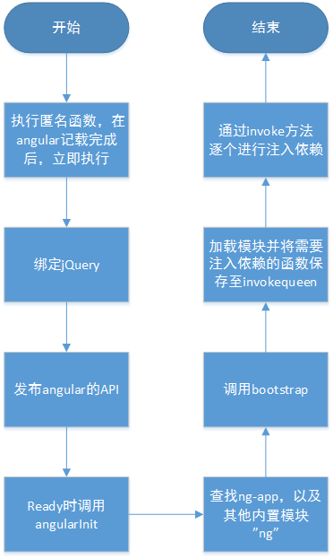

# Angularjs 分享

## 一、angular的依赖注入原理

### 常见对象之间依赖的方式

如果一个function或者object需要一个对象实例，无非是下面三种方式：

1.在函数（构造函数）中通过new关键字实例化依赖对象，并与某个属性绑定。

```
function A(){
  console.log("this is A")；
};

function B(){
  this.a = new A();
}
```

2.显式查找外部环境中的依赖实例并应用

```
function A(){
  console.log("this is A")；
};

var services= {
  a: new A(),
  get: function(name){
    return this[name.toLocaleLowerCase()];
  }
}

function B(){
   this.a = services.get("A");
}
```

3.在外部创建依赖实例，然后注入至对象中。
```
function A(){
  console.log("this is A")；
};

var a = new A();

// 通过构造函数注入
function B(instance){
   this.a = instance;

   this.setter = function(value){
      this.a = value;
   }
}
new B(a);

// 通过Setter方式注入
var b = new B();
b.setter(a);

// 直接通过属性注入
var b = new B();
b.a = a;

```
 
  + 对于第一种方式，在对象B中进行硬编码，这就使得当依赖变得不可用时,要修改依赖相关的代码变得非常困难和繁琐，一旦A进行替换，则B也必须记性修改。
  + 对于第二种方式，较第一种方式有改进，但是当B的依赖改变时，仍需修改B的代码。
  + 第三种方式，获取依赖的方式对B完全透明，完全由第三方注入，在更换依赖时，B无需做其他更改。第三种方式就常数的依赖注入。

下面会进行更加细致的说明。

### 1. 什么是依赖,什么IOC、DI，两者之间的关系是什么？

**依赖** 通俗的讲，一个对象需要完成某个动作或者功能，需要依靠另外一个对象提供功能或服务，则就是依赖

**控制反转**（Inversion of Control，缩写为IoC），是面向对象编程中的一种设计原则，可以用来减低代码之间的耦合度。通俗的将，控制反转就是将创建依赖的对象的实例的权限交给第三方，而当前对象不关心创建的过程及逻辑，只需指定我们需要的依赖即可。

**依赖注入**（Dependency Injection，简称DI）是IOC的一种实现方式，对象在指定了依赖之后，根据指定的依赖标志获取具体的依赖实例，注入到对象中即可，以此来达到控制范围的目的。

### 2. Angular的DI？

#### 2.1 Bootstrap启动
为了更清楚的了解依赖注入的过程，我们先简单的分析下整个`angular`的启动过程，尽可能将关注点放在依赖注入身上，因此会忽略其细节。`angular` 在创建`controller`、`service`等时并未直接注入依赖，而是先将需要注入依赖的`function`保存只列表中，最后在`domready`时逐一注入依赖,如图：


 
#### 2.2 angular的3种注入依赖的方式

在angular内部，DI随处可见，如`filter`、`directive`、`controller`等的创建过程。而angular也提供了多种依赖注入的方式，下面以cotroller的创建举例说明。

Angular的依赖注入可分为3种[DEMO](angular-share/IOC/injectDemo.html)：

- 查询推断注入：通过函数签名中的参数列表注入依赖
```
myModule.controller('MyCtrl', function($scope) {
  // ...
});
```

- 内联数组注入的方式： 通过数组指定依赖
```
myModule.controller('MyCtrl', ['$scope', function($scope, greeter) {
// doSomething
});
```

- $inject属性注入： 通过指定函数的$inject来指定依赖
```
var MyCtrl = function($scope) {
    // doSomething 
};
MyCtrl.$inject = ['$scope'];
myModule.controller('MyCtrl', MyCtrl);
```

三种依赖注入的方式比较：

  -  第一种方式，代码更加简洁，但是在线上环境压缩代码之后，形参会被替换为angular不可识别的变量，导致代码错误。
  -  第二种方式最为常用，controller第二参数中，前n-1的依赖顺序，需要与function中参数列表保持一致。
  -  第三种方式，需要额外通过参数指定具体的依赖列表。

目前第二种方式最为常见，既避免压缩导致的错误，用于也无需刻意指定$inject属性，因此依赖过程更为透明。

#### 2.3 实现过程

依赖注入作为一种软件设计模式，很多编程语言中进行实现，如JAVA的`Spring`框架，PHP的`Laravel`框架，.NET的`Autofac`，再配合面向对象的接口编程和多态特性，让依赖更加容易管理。

#### 2.3.1 java等语言中如何实现的IOC

以java的`Spring`为例简要说明其实现原理。

1.`Spring`通过配置文件，来管理对象之间的依赖，使依赖的管理更为方便，下面是`Spring`的一个配置文件demo：
```
<?xml version="1.0" encoding="UTF-8"?>
<beans xmlns="http://www.springframework.org/schema/beans"
    xmlns:xsi="http://www.w3.org/2001/XMLSchema-instance"
    xsi:schemaLocation="http://www.springframework.org/schema/beans 
        http://www.springframework.org/schema/beans/spring-beans-2.5.xsd">

    <bean id="sampleService" name="sampleService" class="cn.test.springDemo.SampleServiceImpl" />

    <bean name="sampleAction" class="cn.test.springDemo.SampleAction" scope="prototype" >
        <property name="service" ref="sampleService"/>
    </bean> // ref即为当前对象的依赖，会通过ref找到id为sampleService的实例并注入，通过service变量进行接收。
</beans>
```
2.在`Spring`容器启动时，读取配置，通过bean标签中的`class`属性找到该类的路径，由于java的反射特性，可通过`class`路径加载对应的`class`文件，并获取到其构造函数、普通方法。`spring`容器实例化依赖对象，通过`setter`方法注入到目标对象中即可。

容器读取`sampleAction`时，`property`意味着`sampleAction`存在一个`setService`的`set`方法，其依赖为`ref`字段即`sampleService`，会通过ref找到id为`sampleService`的实例，然后通过`set`方法注入`sampleAction`中。

#### 2.3.2 angular依赖注入实现的方式

下面以创建一个`controller`为例说明其过程。

angular内容通过`invoke`方法为为`controller`注入依赖。

```
app.controller('myControl',function myControl($scope) {
    $scope.firstName = "alan";
    $scope.secondName  = "zhang";
});
```

注入过程（为说明该过程，代码了简化）：
第一步，拿到controller构造函数，通过其`toString()`获取到函数源码

```
var fnStr = myControl.toString()
```

第二步，通过正则表示获取其参数列表

```
var FN_ARGS = /^[^\(]*\(\s*([^\)]*)\)/m;

// 获取参数列表
var argDecl = fnStr.match(FN_ARGS);

// 保存依赖数组
var $inject = [];

// 通过参数获取依赖名称
forEach(argDecl[1].split(FN_ARG_SPLIT), function(arg) {
    // 保存依赖的名称
    arg.replace(FN_ARG, function(all, underscore, name) {
        $inject.push(name);
    });
});
```

第三步，通过根据参数名，获取具体的依赖实例
```
var args = [],

// 根据依赖名称获取具体的依赖实例
for (var i = 0, length = $inject.length; i < length; i++) {
    var key = $inject[i];
    args.push( getService(key, serviceName));
}
return args;
```

第四步，通过apply的方式注入依赖

```
myControl.apply(self, args)
```

通过上面简易的四部，`angular`即完成了注入依赖。

对于数组方式的输入依赖，通过去数组中的n-1个元素，即可得到其依赖列表，对于`$inject`方式的依赖，直接获取其`$inject`属性即为依赖。其余步骤通上面的三、四步。
由于压缩会导致形式参数名称改变，因此上面的例子在代码压缩之后，获取的依赖列表将无法正确的获取到依赖实例，因此，建议通过数组的方式或者$inject的方式注入依赖。

为了应对这种情况，angular提供了 `ng-strict-di`标签来检测查找注入的方式，当ng-app所在标签使用了`ng-strict-di`,则会抛出异常。

下面是关键代码及注释：

**获取参数列表代码，主要方法为annotate：**
```
/**
 * @ngdoc module
 * @name auto
 * @description
 *
 * Implicit module which gets automatically added to each {@link auto.$injector $injector}.
 */

// 正则：获取箭头函数参数列表
var ARROW_ARG = /^([^\(]+?)=>/;

// 正则：获取普通函数参数列表
var FN_ARGS = /^[^\(]*\(\s*([^\)]*)\)/m;

// 正则：获取参数列表的分隔符
var FN_ARG_SPLIT = /,/;

var FN_ARG = /^\s*(_?)(\S+?)\1\s*$/;

// 正则：匹配函数注释
var STRIP_COMMENTS = /((\/\/.*$)|(\/\*[\s\S]*?\*\/))/mg;

// 再次封装的Error的构造函数，由于标志不同的模块，活在Error的message信息中加入模块名称，
var $injectorMinErr = minErr('$injector');

/**
 * [extractArgs 正则匹配出函数的参数]
 * @param  {Function} fn [构造函数，一般是注册ctrl，service的构造函数]
 * @return {[type]}      [参数列表]
 */
function extractArgs(fn) {
        // 获取函数内容
    var fnText = fn.toString()
                 // 去除注释
                 .replace(STRIP_COMMENTS, ''),

        // 正则匹配出参数列表
        args = fnText.match(ARROW_ARG) || fnText.match(FN_ARGS);
    return args;
}

/**
 * [anonFn 处理匿名函数，有参数的函数返回‘function(参数)’ 没有参数的函数，返回‘fn’]
 * @param  {Function} fn [description]
 * @return {[type]}      [description]
 */
function anonFn(fn) {
    // For anonymous functions, showing at the very least the function signature can help in
    // debugging.
    var args = extractArgs(fn);
    if (args) {
        return 'function(' + (args[1] || '').replace(/[\s\r\n]+/, ' ') + ')';
    }
    return 'fn';
}

/**
 * [annotate 根据函数匹配出他的依赖列表]
 * @param  {Function} fn       [注册的服务的构造函数]
 * @param  {[Boolean]} strictDi [是否为严格注入方式，即不允许通过函数参数的方式注入依赖]
 * @param  {String}  name      [实例化的服务名称]
 * @return {[type]}            [description]
 */
function annotate(fn, strictDi, name) {
    var $inject,
        argDecl,
        last;

    // 通过$inject属性注入依赖 或者 查找注入依赖
    if (typeof fn === 'function') {

        // 先保存 $inject属性
        // 如果fn.$inject为空或者长度为0，则进入if，通过参数列表获取依赖列表
        if (!($inject = fn.$inject)) {
            $inject = [];

            // 函数存在参数
            if (fn.length) {

                // 严格的依赖注入方式，则报错
                if (strictDi) {
                    if (!isString(name) || !name) {
                        name = fn.name || anonFn(fn);
                    }
                    throw $injectorMinErr('strictdi',
                        '{0} is not using explicit annotation and cannot be invoked in strict mode', name);
                }

                // 获取函数参数列表
                argDecl = extractArgs(fn);
                forEach(argDecl[1].split(FN_ARG_SPLIT), function(arg) {

                    // 保存依赖的名称
                    // ？：这里再次进行了replace不太懂
                    arg.replace(FN_ARG, function(all, underscore, name) {
                        $inject.push(name);
                    });
                });
            }

            // 设置函数的$inject属性，通过参数传依赖的方式最终还是通过函数属性的方式保存
            fn.$inject = $inject;
        }

    // 内联数组注入的方式注入依赖
    } else if (isArray(fn)) {
        last = fn.length - 1;
        assertArgFn(fn[last], 'fn');

        // 前n-1个参数为依赖的名称
        $inject = fn.slice(0, last);
    } else {
        assertArgFn(fn, 'fn', true);
    }

    // 返回了依赖列表
    return $inject;
}

```

**获取依赖实例数组**：
```
/**
 * [injectionArgs 根据函数签名获取函数的依赖名称，根据依赖名称获取依赖实例]
 * @param  {Function} fn          [构造方法]
 * @param  {OBJECT}   locals      [已存在的依赖实例map]
 * @param  {[type]}   serviceName [在获取不到依赖时，根据该名称来创建实例]
 * @return {[type]}               [description]
 */
function injectionArgs(fn, locals, serviceName) {
    var args = [],

        // 获取函数依赖的名称数组
        $inject = createInjector.$$annotate(fn, strictDi, serviceName);

    // 根据依赖名称获取具体的依赖实例
    for (var i = 0, length = $inject.length; i < length; i++) {
        var key = $inject[i];
        if (typeof key !== 'string') {
            throw $injectorMinErr('itkn',
                'Incorrect injection token! Expected service name as string, got {0}', key);
        }
        args.push(locals && locals.hasOwnProperty(key) ? locals[key] :

            // 根据名字获取服务，如果服务不存在，尝试使用factory(key, serviceName)创建服务
            getService(key, serviceName));
    }
    return args;
}
```

**为函数注入依赖:**
```
/**
 * [invoke 为函数注入依赖]
 * @param  {Function} fn          [构造函数]
 * @param  {[type]}   self        [函数运行环境]
 * @param  {[type]}   locals      [本地已存在的依赖map]
 * @param  {[type]}   serviceName [description]
 * @return {[type]}               [description]
 */
function invoke(fn, self, locals, serviceName) {

    if (typeof locals === 'string') {
        serviceName = locals;
        locals = null;
    }

    // 获取依赖的实例
    var args = injectionArgs(fn, locals, serviceName);

    // 如果是数组，则最后一个元素为
    if (isArray(fn)) {
        fn = fn[fn.length - 1];
    }

    // 不是Class，而是普通函数
    if (!isClass(fn)) {
        // http://jsperf.com/angularjs-invoke-apply-vs-switch
        // #5388
        // 在fn中注入依赖
        return fn.apply(self, args);

    // fn为class时按照Function实例来进行注入
    } else {
        args.unshift(null);
        return new(Function.prototype.bind.apply(fn, args))();
    }
}

```

### 3. 如何自己实现一个DI的模型？

通过对angular依赖注入的说明，我们可实现一个简易版的DI模型。代码见[DI](angualr-share/IOC/DiModel.js)

```
var DI = {
    // 保存依赖
    dependencies: {
        $http: {
            post: (data) => {
                console.info("post...",JSON.stringify(data));
            },
            get: (data) => {
                console.info("get",JSON.stringify(data));
            }
        }
    },
    // 注册依赖
    register: function (key, value) {
        this.dependencies[key] = vlaue;
    },
    // 获取服务
    getService: function(key) {
        return this.dependencies[key];
    },
    // 获取参数列表
    annotate: function(fn) {
        let FN_ARGS = /^[^\(]*\(\s*([^\)]*)\)/m;
        let FN_ARG_SPLIT = /,/;
        let $inject = [];
        let argDecl = Function.prototype.toString.call(fn).match(FN_ARGS);

        argDecl[1].split(FN_ARG_SPLIT).forEach((name) => {
            $inject.push(name);
        });
        return $inject;
    },
    // 获取依赖列表
    injectionArgs: function(fn) {
        let $inject = this.annotate(fn);
        let args = [];

        $inject.forEach((item) => {
            args.push(this.getService(item));
        });

        return args;
    },
    // 注入依赖
    invoke: function(fn, context) {
        var args = this.injectionArgs(fn);
        fn.apply(context, args)
    }

};

// demo：
class MyModule{

    constructor(name){
        this.moduleName = name;
    }
    controller(ctrl,fn){
        DI.invoke(fn);
    }
}

var mod = new MyModule("myApp");

mod.controller("myCtrl",function($http){
    $http.post({
        url:"/",
        data:{
            age:18
        }
    });
});
```

### 4. 使用DI的好处，以及对于我们编码的启示？

DI的核心就是将依赖对象的创建交给第三方，据我理解，这种方式带来的好处如下：
- 解耦，降低对所依赖对象的依赖关系;
- 将依赖交给第三方管理，管理更方便，使用效率也更高（例如创建单例）;
- 便于测试。比如A模块依赖B模块，在测试A的时候，B未完成开发前，只需mock一个对象，提供类似API注入即可，A模块基本。不需要任何修改
- 降低代码耦合带来的其他常见好处如：
  + 代码更容易复用
  + 更容易组织分工

###  二、angularjs的AOP原理

###　三、angularjs的坑

#### 1. `angular.module("",[])`与`angular.module("")`。见[hole1](angular-share/hole01/index.html)

`angular.module('name', [])`是创建一个新的`module`，`[]`表示它没有依赖任何其他模块，如果已经有了一个同名模块，则会覆盖现有的。
而`angular.module('name')`是查找一个现有module，如果这个module不存在，则返回空值。

#### 2. 注入依赖的2中写法。见[hole2](angular-share/hole02/index.html).

代码压缩时，显示参数一般情况下都会被压缩成单个字母以便于节省空间，由于Angular是通过控制器构造函数的参数名字来推断依赖服务名称的，所以通过形参方式传入依赖注入方式将无法生效。**应尽量使用数组的方式传入依赖 ** 。

```
var Ctrl = ['$scope', '$http', function($scope, $http) {}];
var Ctrl =  function($scope, $http) {};
angular.module("moduleName",[]).controller("ctrlName",Ctrl)
```

Angular还提供提供了`ng-strict-di`标签来检测查找注入的方式，当ng-app所在标签使用了`ng-strict-di`,则会抛出异常。

```
<div ng-app="myApp" ng-controller="myControl" ng-strict-di>
```

#### 3. `ng-repeat`重复问题，见[hole3](angular-share/hole03/index.html)

为了尽可能少的去进行dom的渲染，`ngRepeat` 通过一个`keep track`方法来记录集合和对应的dom元素之间的映射关系。例如如果集合中增加了一个元素，那么`ng-repeat`只会渲染增加的dom，其他dom元素不会改变。而在记录映射关系的时候默认是通过元素实例来和dom元素形成一对一的映射关系的，因此默认情况下，出现相同元素时会报错。

通过`track by`来指定映射时的属性或者字段，可以避免这个问题。

```
<div ng-repeat="n in [42, 42, 43, 43] track by $index">
  {{n}}
</div>

<div ng-repeat="n in [42, 42, 43, 43] track by randomNum(n)">
  {{n}}
</div>
```

#### 4. 初始化时会显示{{}}表达式源码。见[hole4](angular-share/hole04/index.html)

当刷新页面时，在ng表示式还未计算出值时，会直接显示`{{something}}`, 通过`ng-clock`解决。将ng-cloak属性直接加载使用了表达式的元素上，或者是moudle上亦可。
同时必须为ng-cloak指定样式。

```
[ng\:cloak], [ng-cloak],[data-ng-cloak], [x-ng-cloak],.ng-cloak,.x-ng-cloak {
  display: none !important;
}
```

#### 5. ng-include的值问题。见[hole5](angular-share/hole05/index.html)

对于使用过php和jsp 中的include的人来说，很容易联想到到ng-include的用法；但是ng中，使用include包含外部的文件时，src必须为一个ng变量或者表达式，直接在scr中写入路径将不会起作用。

```
<ng-include src="./footer.html"></ng-include>
```

正确的方式是src指向一个在$scope中定义的变量

```
html:
<ng-include src="footer"></ng-include>

JS:
$scope.footer = "footer.html";
```

#### 6. 作用域问题[hole6](angular-share/hole06/index.html)

```
<div ng-controller="TestCtrl">
    <div ng-if="show">
        <input type="text" ng-model="name">
    </div>
    <p>your name is {{name}}</p>
</div>
```

在上面这段代码中，输入框内容的改变，下面p标签的内容并不会改变。
    搞清楚花这个问题，需要明白以下几点：

- 每个 Angular 应用默认有一个根作用域 `$rootScope`， 根作用域位于最顶层，从它往下挂着各级作用域。变量查找会通过原型继承向上查找。
- 并不是只有 Controller 可以创建作用域，`ng-repeat`、`ng-include`、`ng-switch`、`ng-view`、`ng-controller`等指令都会（隐式地）产生新作用域。并且进行原型继承。
- 原型继承时对变量的赋值不会修改原型中的值，而是直接在当前scope中创建一个同名的属性；但如果是变量是对象，则不会创建。

>**对于能创建作用域的指令，一般会在所在的dom元素上添加`ng-scope` 的`class`**。

 通过绑定父级作用域或者引用一个引用类型变量即可解决问题。所以$scope中的变量尽可能的以对象的方式出现。下面的绑定方式才能达到预期效果。

```
<div ng-if="show">
    <input type="text" ng-model="data.name">
</div>
<p>your name is {{data.name}}</p>
```

#### 7.ngOption 中的 value问题。见[hole7](angular-share/hole07/index.html)

- ng-options 所在select必须通过ng-model与 某个变量进行绑定，否则无效。


#### 8. 并不是所有的$scope属性的改变都能直接触发渲染[hole7](angular-share/hole08/index.html)

```
<div ng-app="myApp" ng-controller="myControl" ng-cloak>
    现在时间是{{ time.now | date:'yyyy-MM-dd HH:mm:ss Z'}}
</div>
<script type="text/javascript" src="../../angular.min.js"></script>
<script type="text/javascript">
    var app = angular.module("myApp",[]);
    app.controller('myControl',["$scope",function ($scope) {
        window.setInterval(function(){
            $scope.time = {
                now:new Date()
            };
        },800);
    }]);
</script>
```

上面代码并不会如期更新时间。
在angular环境之外执行的表达式如:`setTimeout`,`setInterval`,`XHR`等不会触发`digest`脏检测。`$apply`可以解决此类问题，`$apply`内部会调用eval方法，将所有要执行的函数在当前的scope中执行，并调用$digest脏检测并最终更新视图。
```
function $apply(expr) {
  try {
    return $eval(expr);
  } catch (e) {
    $exceptionHandler(e);
  } finally {
    $root.$digest();
  }
}
```

更加推荐的方式是使用angular内部实现的服务。
```
app.controller('myControl',"$interval",["$scope",function ($scope,$interval) {
    $interval(function(){
        $scope.time = {
            now:new Date()
        };
    },800);
}]);
```

#### 9. jQuery[hole09](angular-share/hole08/index.html)

angular内置了jqlite（简易版的jquery，见[API](https://docs.angularjs.org/api/ng/function/angular.element)）,开发时可能会存在借用jQuery的场景，比如动画。

- 如果要结合jQuery使用，1.5版本的Angular不推荐使用1.x的jQuery版本；
- 为了让angular能检测到jquery，jQuery的加载应该在Angular之前。
- 如果存在外部的jQuery，则angular会采用外部的jQ,同时会扩展`scope`、
`njector`等方法，否则采用内部实现的jQlite。

代码片段：


>应尽量选择官方推荐的配置，否则这里出现问题也很难定位。

>Important: Be sure to use jQuery version 2.1 or newer, when using Angular 1.5; jQuery 1.x is not officially supported. In order for Angular to detect jQuery and take advantage of it, make sure to include jquery.js before angular.js.

>Angular 1.3+ technically requires at least jQuery 2.1+ but it may work with older versions. It will not work for sure with jQuery <1.7, though.


### 总结
你觉得坑多，主要还是文档看的少。

### 参考

- <https://docs.angularjs.org/guide/di>
- <https://docs.angularjs.org/api/ng/function/angular.element>
- <http://www.angularjs.cn/A09C>
- <http://www.alloyteam.com/2015/09/angularjs-study-of-dependency-injection/>
- <http://www.cnblogs.com/asnowwolf/p/3684700.html>
- <https://docs.angularjs.org/tutorial/step_14>