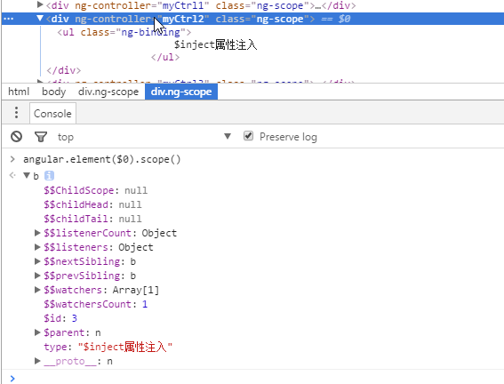

# angularjs1.X 学习

## 说明
### 用于学习angularjs，方便在公司和家里进行同步！

## 比较好的教程
- [Angularjs 官方 Api](https://docs.angularjs.org/api/ng)
- [官方项目](https://docs.angularjs.org/tutorial)
- [中文网站](http://www.angularjs.cn/T006)
- Angularjs深度剖析与最佳实践[源码](https://github.com/ng-nice/code-book-forum)
- 开发指南[中文](http://docs.ngnice.com/guide),[英文](https://docs.angularjs.org/guide)


## 相关文章

- [angular 依赖注入原理](https://github.com/AlanZhang001/angularjs/blob/master/Angularjs%20%E5%88%86%E4%BA%AB.md#一angular的依赖注入原理)
- [angular 遇到的坑](https://github.com/AlanZhang001/angularjs/blob/master/Angularjs%20%E5%88%86%E4%BA%AB.md#三angularjs的坑)


##  笔记
1. 变量命名
以`$`变开头的变量是angular提供的服务，用户在命名变量时以你避免以此字符开头。注入某个作用域的变量，以`$$` 开头的变量一般认为是私有变量并且不应该被改变。

2. Angularjs2.X 使用Typescript 和 ES6实现，不支持IE11以下的浏览器

3. 关于自定义directive.
    - html中使用"aa-bb"的方式，在js中需要使用"aaBb"的方式来指定directive。
    ```
    HTML:
    <div my-info></div>
    JS:
    directive("myInfo",function(){});
    ```
    - directive前缀不能使用ng，避免与angular内置的directive冲突

4. 在chrome console中，鼠标定位只某个具体的ng-scope,通过`angular.element($0).scope()`即可打印出户当前节点绑定的作用域了。



5.  directive scope 的含义
- @：单向引用父域的值，传递的值必须是字符串且在指令里引用时必须加上{{}}；

- =：双向绑定子域和父域；不需要加加上{{}}；

- &：单向绑定父域，以便在其中运行函数，加上{{}}；如果需要将此值传给原生组件，需要先执行一次，比如

```
//原生实现需要调用的是onChangeNew方法
let onChangeNew = @scope.onChange()
```